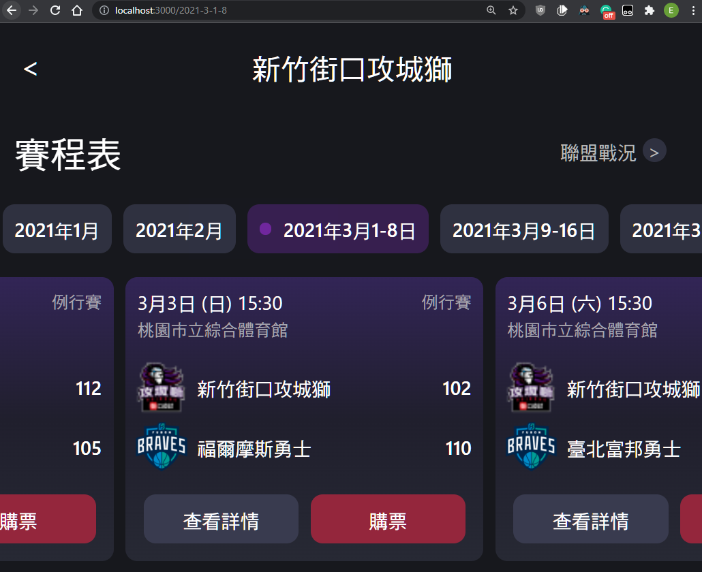

# react-race-schedule

A game schedule. The vercel branch for deployment.

<p align="center">
  
</p>

- React
- TypeScript
- React Router
- Json-Server for a fake backend
- Scroll dates or schedule on drag

## Usage

### Run

npm

```shell
npm i  # install dependencies
npm run backend  # for api on port 5000
npm run start  # for react app
```

yarn

```shell
yarn  # install dependencies
yarn backend  # for api on port 5000
yarn start  # for react app
```

## API

IGameDate

```json
{
  "id": string,
  "text": string,
}
```

IGameInfo

```json
{
  "id": number,
  "time": string,
  "gameType": string,
  "location": string,
  "team1": string,
  "team1Num": number,
  "team1LogoUrl": string,
  "team2": string,
  "team2Num": number,
  "team2LogoUrl": string,
}
```
